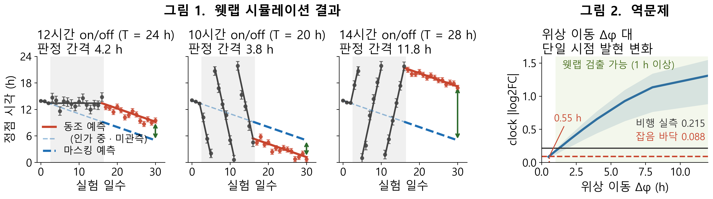

# 중력은 생체시계의 비광학적 동조원이 될 수 있는가

**공개 데이터 실현가능성 감사 → 축별 정합성 분석 → 검정력 기반 동물실험 설계**

2026 KASA 우주항공 학술 경연대회 제출 연구계획서의 사전 드라이랩 전체. 문서에 실린 모든 수치는 이 저장소의 스크립트 재실행으로 재현된다.

> **English summary** — Can gravity act as a non-photic zeitgeber for the circadian clock? Before testing this, we audited whether public spaceflight data *could* answer it: an exhaustive sweep of 633 NASA OSDR studies / 157,801 files found **zero** datasets with ≥4 sampling points spanning 24 h. The only flight experiment designed for circadian rhythms (Neurolab STS-90) has no data submitted to the archive. We therefore reframed the contribution as (1) a quantified feasibility audit, (2) an axis-by-axis concordance analysis separating which physiological readouts transfer from ground analogs to spaceflight, and (3) a power analysis grounding a concrete wet-lab design. Fully reproducible: 48 Python scripts, 103 documented figures cross-checked against outputs by a single command.

---

## 요약

중력으로 circadian rhythm을 조절할 수 있는지 검증하려 했다. 그런데 분석에 들어가기 전에 **공개 데이터가 이 질문에 답할 수 있는지부터** 확인해야 했고, 답은 "없다"였다.

- NASA OSDR **스터디 633건 / 파일 157,801개**를 전수 훑어 리듬 후보 52개 파일(5개 스터디)을 추렸다. 그중 **하루 4점 이상을 24시간에 걸쳐 확보한 것은 0건**이다.
- 일주기를 목적으로 설계된 유일한 비행 실험 **Neurolab STS-90**(쥐 24마리, 16일 연속 체온·심박)은 NASA 아카이브에 `No data submitted by PI`로 기록돼 원자료가 존재하지 않는다.
- 지상 아날로그에 중력을 되돌려 넣은 유일한 통제 실험 **AGBRESA**(60일 침상안정 + 단완 원심분리)는 일주기 위상을 측정하지 않았다.

그래서 기여를 재배치했다. "공개 데이터에서 dose-response를 찾겠다"를 버리고, **없다는 것을 정량 입증한 뒤 그것을 웻랩 실험의 정당화로 쓰는** 구조로 바꿨다.

## 핵심 결과

**1. 원논문 재현에 성공했고, 지상 대체모델로는 재현되지 않는다**

우주비행 시 조직 간 clock gene 비동기화(Life 2020)를 사전 규정한 기준 3개 모두에서 재현했다. 같은 현상이 지상 후지현수(HLU) 모델에서는 나타나지 않는다 — clock 유전자가 전사체 전역 대비 얼마나 크게 반응하는가로 정규화하면 **비행 3.11배 vs HLU 0.78배**다. 이 정규화가 "HLU 실험의 신호가 원래 약해서"라는 대안 설명을 배제한다.

**2. 전이되는 축과 아닌 축이 갈린다**

| 축 | 지상 언로딩 (원자료 n=3 코호트) | 실제 비행 (중력만 분리) | 판정 |
|---|---|---|---|
| 활동량 수준 | −80% / −79% / −49% (전부 0 배제) | **+2.7%** [−0.2, +6.0] | 부호가 반대 — **전이 안 됨** |
| 체온 위상 | +1.69 / +0.27 / +2.25 h (전부 지연) | 영장류 Cosmos 보고도 지연 | 방향 일치 — **전이됨** |

"HLU가 우주와 같다"를 통째로 증명하는 대신, 전이되는 축을 골라내 **1차 종말점을 거기에 올린 것**이 이 프로젝트의 논증 구조다.

**3. 실측 잡음에서 표본수를 뽑았다**

문헌값이 아니라 확보한 원자료(Hélissen 2023 텔레메트리)의 개체 내 위상 표준편차를 직접 재서 검정력을 계산했다. 후지현수 인가 중에는 위상 추정 오차가 baseline 대비 **3.6~38배** 커진다(마스킹) — 그래서 인가 중이 아니라 **제거 후 자유진행 구간의 갈라짐**을 판정 신호로 삼는 설계가 나왔다.

→ 심부체온 Δφ=1 h 검출에 군당 **8마리**, Δφ=2 h에 **4마리**. 1차 종말점 심부체온, 2차 활동량.



*좌: 인가 중에는 동조와 마스킹이 같은 궤적을 그려 구별되지 않고, 제거 후 갈라지는 간격(초록 화살표)이 판정 신호다. 우: 위상만 Δφ 이동했을 때 단일 시점 전사체에서 보일 발현 변화 — 왜 단일 시점 데이터로는 위상을 되찾을 수 없는지.*

## 재현

```bash
pip install -r requirements.txt

python src/v3_verify.py        # 문서 수치 전건 대조 → 통과 103 / 실패 0
python run_all.py --check      # 산출물·핵심 수치 검증 (재실행 없이)
python run_all.py              # 전체 파이프라인 재실행 (최초 약 400 MB 다운로드)
```

`v3_verify.py`는 문서에 적은 숫자와 산출물을 전건 대조한다. 문서를 고쳤는데 스크립트를 다시 안 돌렸거나 그 반대인 경우를 잡기 위한 것이다.

개별 실행도 가능하며, 스크립트는 서로 독립이고 `cache/`를 공유한다.

```bash
python scripts/build_inventory.py       # 인공중력 스터디 인벤토리
python scripts/clock_dose_response.py   # clock 용량반응 + 최소검출효과크기
python scripts/positive_control.py      # 양성대조 (파이프라인 무결성 검증)
python scripts/oscillator_model.py      # 진동자 모델 / PRC / Arnold tongue
python scripts/phase_predictor.py       # 위상 추정기 + LOTO 검증
python scripts/power_analysis.py        # 검정력 → 표본수
python src/v3_r1_osdr_sweep.py          # OSDR 157,801 파일 전수 감사
python src/v3_r4_concordance.py         # 축별 정합성
```

## 이 프로젝트에서 철회한 주장

분석 도중 스스로 뒤집은 결론들이다. 커밋 로그에 시각과 함께 남아 있다.

| 커밋 | 철회한 것 |
|---|---|
| `5aadf22` | "3.5시간" 논증 — 잡음 바닥을 확인하지 않고 효과 크기를 과장했다 |
| `2675746` | 조직 매칭 재분석으로 전날 결론 3건 |
| `7e3c229` | 미션 효과 주장 — 표 3·4 재검증에서 근거가 무너졌다 |
| `290b74c` | 진동자 모델 관련 정량 과장 |
| `1f64b42` | baseline 연장 권고 — 검정력 격자를 세분화하니 불필요했다 |
| `f51fd1c` | 표 5 논증 결함 (외부 피드백 반영), 1단계 재현 범위 한정 |
| `49780c3` | 앵커 그림의 유전자 선택 편향 |

기록해 둔 이유: **clock null 결과는 "효과가 없다"의 증거가 아니라 "분해능이 부족하다"의 증거**다. 군당 n=3~6에서 최소검출효과크기가 1.6~2.9배라, 원논문이 보고한 산화스트레스 모듈조차 이 규모에서는 검출되지 않는다. 이 구분을 지키는 것이 프로젝트 내내 가장 어려웠고, 위 철회들은 대부분 그 경계를 넘었다가 되돌아온 기록이다.

미결 사항은 [`OPEN_QUESTIONS.md`](OPEN_QUESTIONS.md)에 그대로 남겨 두었다.

## 문서

| 문서 | 내용 |
|---|---|
| [`드라이랩_분석보고.md`](드라이랩_분석보고.md) | **주 문서.** 방법과 결과 전체. 절별로 데이터·전처리·검정 방법 명시 |
| [`정리_전체요약.md`](정리_전체요약.md) | 비전공자용 요약 + 용어 사전 |
| [`연구계획_v2.md`](연구계획_v2.md) | 개정 연구계획서 초안 |
| [`FINAL_REPORT.md`](FINAL_REPORT.md) | Stage별 판정 (완료 / 조건부 / 판정 불가) |
| [`OPEN_QUESTIONS.md`](OPEN_QUESTIONS.md) | 미결 사항 |
| [`결과_week1-4.md`](결과_week1-4.md) · [`결과_week5-6.md`](결과_week5-6.md) | 주차별 결과 |
| `docs/` | 제출 원고, 팀 공유 문서, 작업 기록 |

## 데이터 출처

| 출처 | 용도 | 라이선스 / 접근 |
|---|---|---|
| NASA OSDR | 비행·지상 마우스 전사체, 행동 데이터 | 공개, 인증 불필요 (REST API) |
| NCBI GEO **GSE54650** | 지상 circadian atlas (12조직 × 24시점) — 위상 추정기 학습 | 공개 (FTP) |
| **Hélissen 2023** `doi:10.57745/QVRW8W` | HLU 마우스 텔레메트리 2 h bin × 11일, 개체별 | Etalab Open License |
| **HDBR 심부체온** `doi:10.6084/m9.figshare.13633790` | 인간 60일 침상안정, 3주차·8주차 각 32 h | CC BY 4.0 |

내려받은 원본은 SHA256으로 고정했다(`data/rhythm/manifest.csv`). 문헌 보고 수치로 채운 칸은 원자료 기반과 `tier` 열로 구분해 표기했으며, **원자료 칸에서만 효과 크기를 주장한다.**

### 재현 시 함정 두 가지

- 중력 조건은 `/osdr/data/osd/meta/{id}` JSON API가 **null을 반환한다.** `ISA.zip` 안의 `s_*.txt`를 파싱해야 한다.
- 유전자 심볼은 `Arntl`이 아니라 `Bmal1`이다 (MGI 변경). 틀리면 예외 없이 조용히 NaN이 된다.
- `GLOpenAPI`는 서비스 중단(404).

## 맥락

2026 KASA 우주항공 학술 경연대회(우주항공청 / 한국과학창의재단) 대학부 제출작. 4인 팀(컴퓨터공학 2 + 생명과학 2)이며, 이 저장소는 그중 **데이터 분석·시뮬레이션 파트**의 산출물이다. 수상하지 못했다.

규모: Python 48개 파일 / 약 9,800줄, 커밋 47건.
