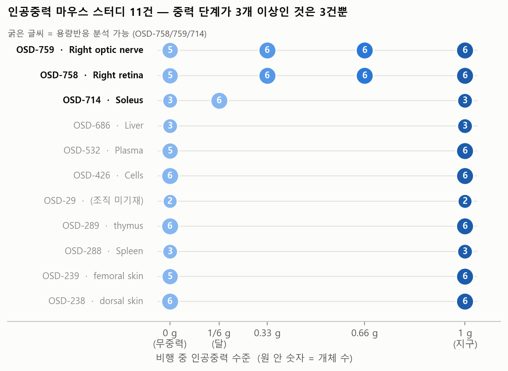
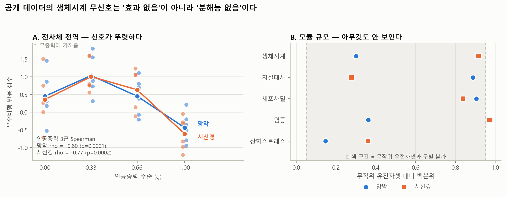
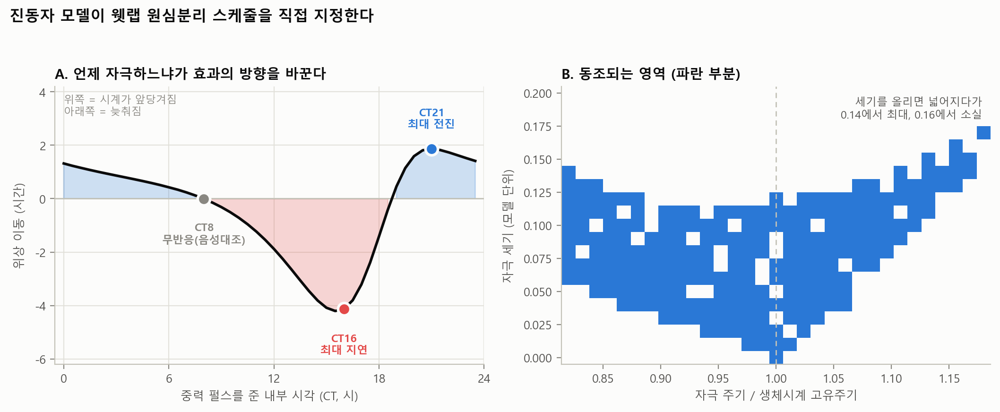
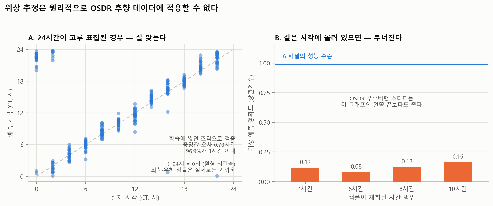
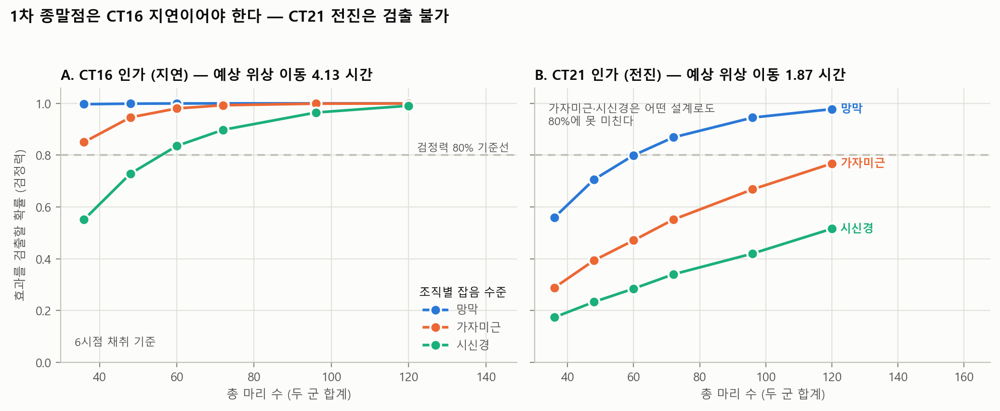

# 드라이랩 분석 보고

중력에 의한 circadian rhythm 조절 — 공개 데이터 분석 및 in-silico 시뮬레이션

작성 2026-07-27 · 재현 `python run_all.py`

---

## 1. 개요

### 1.1 목적

연구계획서 작성을 위한 사전 분석. 두 가지를 목표로 했다.

1. NASA 공개 데이터로 중력의 circadian 조절 효과를 검정할 수 있는지 판정
2. 검정 가능하다면 그 결과를, 불가능하다면 그 근거와 대안 실험 설계를 산출

### 1.2 결론 요약

공개 데이터로는 검정할 수 없다. 세 가지 구조적 결함 때문이며 각각을 정량화했다.
따라서 계획서의 논지를 "공개 데이터에서 증거를 찾는다"에서
"공개 데이터로 답할 수 없음을 입증하고 그 공백을 메울 실험을 설계한다"로 전환했다.

전환 후 산출물은 지상 과중력 원심분리 실험의 설계안이다. 자극 인가 시각, 자극 세기,
표본수, 채취 시점이 모두 모델 예측과 실측 분산에서 도출됐다.

### 1.3 분석 구성

| # | 분석 | 스크립트 | 산출 |
|---|---|---|---|
| 1 | 데이터 적합성 감사 | `build_inventory.py` | `studies_gravity.csv` |
| 2 | clock 용량반응 · 검정력 한계 | `clock_dose_response.py` | `preliminary_summary.csv` |
| 3 | 양성대조 | `positive_control.py` | `positive_control_*.csv` |
| 4 | 지상 모사 · 시계열 데이터 탐색 | `ground_and_telemetry.py` | `ground_studies.csv` |
| 5 | 궤도 행동 리듬 | `behavior_rhythm.py` | `behavior_rhythm_*.csv` |
| 6 | 진동자 모델 · PRC · 동조 | `oscillator_model.py` | `model_*.csv` |
| 7 | 단일 샘플 위상 추정 | `phase_predictor.py` | `phase_predictor_*.csv` |
| 8 | 검정력 · 표본수 | `power_analysis.py` | `power_curve.csv` |

---

## 2. 데이터 및 전처리

### 2.1 취득 경로

**NASA OSDR** (Open Science Data Repository). 인증 불필요, REST API.

1. Search API로 `organism = Mus musculus` 레코드를 100건씩 페이징해 전수 수집 (7,061건)
2. `Study Factor Name` 필드에 `Altered Gravity`가 포함된 스터디를 추출 (11건)
3. 각 스터디의 File API에서 `*-ISA.zip`(ISA-Tab 메타데이터 아카이브)을 내려받아
   `s_*.txt`(샘플 테이블)를 탭 구분 파싱
4. 발현 행렬은 GeneLab 표준 워크플로 처리본
   `*_rna_seq_Normalized_Counts_GLbulkRNAseq.csv`를 사용. FASTQ 재정렬은 하지 않았다
5. ENSEMBL → 유전자 심볼 매핑은 같은 스터디의
   `*_differential_expression_GLbulkRNAseq.csv`에 포함된 어노테이션 컬럼에서 추출

> **중요**: 중력 조건을 `/osdr/data/osd/meta/{id}` JSON API에서 읽으면 안 된다.
> 이 엔드포인트는 `Factor Value[Altered Gravity]`를 **null로 반환한다**(2026-07 확인).
> 실제 값(`0.33G by centrifugation` 등)은 ISA 아카이브에만 있다.
> 계획 초안이 지정했던 `GLOpenAPI`는 서비스가 중단됐다(404).

**NCBI GEO GSE54650** (Zhang et al. 2014 마우스 circadian atlas).
위상 추정기 학습 및 진폭 추정에 사용. series matrix + GPL6246 플랫폼 어노테이션을 FTP로 취득.

### 2.2 대상 스터디

비행 중 인공중력 단계가 3개 이상인 스터디만 용량반응 분석 대상이 된다.

| OSD | 조직 | 비행 중 중력 단계 | 군별 n | 지상대조 |
|---|---|---|---|---|
| 758 | 우측 망막 | 0 / 0.33 / 0.66 / 1 g | 5 / 6 / 6 / 6 | 12 |
| 759 | 우측 시신경 | 0 / 0.33 / 0.66 / 1 g | 5 / 6 / 6 / 6 | 12 |
| 714 | 가자미근 | 0 / 1/6 / 1 g | 3 / 6 / 3 | 9 |

나머지 8건(238, 239, 288, 289, 426, 532, 686, 29)은 μg vs 1g 2단계뿐이다.
OSD-714의 1/6 g는 달 중력에 해당하며, 부분중력 프레임에 직접 대응하는 유일한 공개 데이터다.

메타데이터 표기와 논문 본문이 어긋나는 지점이 하나 있다. ISA는 `0.66G`,
논문 본문은 `0.67G`로 적고 있다. 원심 회전수는 44 / 63 / 77 rpm이다.

### 2.3 전처리

- 발현값은 `log2(normalized_count + 1)`
- 유전자 심볼은 MGI 현행 표기를 따른다. **`Arntl`은 `Bmal1`로 변경됐다.**
  구 심볼로 조회하면 예외 없이 조용히 NaN이 된다
- GSE54650은 GC-RMA 정규화된 **선형 강도**다(중앙값 100, 최대 45,308).
  log2 변환 후 사용한다
- clock 유전자 패널 (17개):
  `Bmal1, Clock, Npas2, Per1, Per2, Per3, Cry1, Cry2, Nr1d1, Nr1d2, Dbp, Tef, Hlf, Ciart, Bhlhe40, Bhlhe41, Rorb`

---

## 3. 분석 1 — 데이터 적합성 감사

### 3.1 방법

11건 전체의 ISA 샘플 테이블에서 전 컬럼을 나열하고, 시간 관련 필드의 존재 여부를 확인했다.
추가로 OSDR 마우스 레코드 7,061건 전체의 `Parameter Value`, `Characteristics`,
`Factor Value`, 프로토콜 서술문을 대상으로
`zeitgeber | ZT\d | circadian time | CT\d | time of day | lights on | euthanasia time`
정규식 검색을 수행했다.

시료 채취 시점은 각 스터디의 `i_Investigation.txt`에 포함된 프로토콜 서술문에서 확인했다.

### 3.2 결과

**(1) 희생 시각이 기록된 우주비행 스터디는 0건이다.**

존재하는 시간 관련 필드는 `Parameter Value[light cycle]`(값은 전부 `12 h light/dark cycle`)과
`Parameter Value[Euthanasia Date]`(날짜만, 시각 없음)뿐이다. 정규식 검색에서 ZT/CT 표기가
나온 것은 지상 GEO 데이터셋(예: OSD-949의 ZT0/ZT12)뿐이며 비행 데이터에는 없다.

시각 정보 없이는 clock gene 발현값의 해석이 불가능하다. 단일 시점 측정에서 발현값의 분산은
처리 효과가 아니라 개체별 내부 위상차가 지배하기 때문이다.

**(2) 모든 시료가 착륙 후에 채취됐다.**

OSD-758 프로토콜:
> *"The flight mice were then splashed down in the Atlantic Ocean on April 15, 2023 and
> returned to Earth alive. … **Within 6 hours of splashing down**, mice were euthanized"*

OSD-714:
> *"All mice survived and returned to Earth, and skeletal muscle was collected
> **two days after landing**."*

궤도상 채취 시료는 없다. 동물은 재진입(과중력 과도상태) → 착수 → 회수 → 수송을 겪은 뒤
희생됐으므로, 30일간의 인공중력 노출 효과와 착륙 전후 급성 스트레스·1 g 재적응 효과가
원리적으로 분리되지 않는다.

교락이 하나 더 있다. OSD-758/759에서 uG군은 전원 4/16 희생인 반면 원심군은 4/15~16에
걸쳐 있다. 중력군과 착수 후 경과시간이 부분적으로 교락돼 있다. 지상대조군은 4/19다(3일 지연 운용).

**(3) 지상 모사 데이터에는 SCN이 없다.**

hindlimb unloading 및 microgravity simulation 마우스 스터디 29건을 추출했다.
조직은 근육·세포·비장에 편중돼 있고 뇌 조직은 3건(OSD-202, OSD-32, OSD-792),
SCN 특이 조직은 0건이다.



---

## 4. 분석 2 — clock 유전자 중력 용량반응

### 4.1 방법

대상은 §2.2의 3개 스터디. 비행 샘플만 사용하고 지상대조는 제외했다
(지상대조는 중력 축의 연장선이 아니라 별도 배치이므로).

중력 조건 문자열을 수치로 매핑한다: `uG → 0`, `1/6G → 0.167`, `0.33G → 0.33`,
`0.66G → 0.66`, `1G by centrifugation → 1.0`.

**유전자 수준**: 각 clock 유전자에 대해 Spearman 순위상관 `ρ(G, log2 expr)`를 계산.
Spearman을 쓴 이유는 용량반응이 선형이라고 가정할 근거가 없고, 순위 단조성만 검정하면
충분하기 때문이다.

**모듈 수준**: 패널 전체의 `mean|ρ|`를 검정통계량으로 삼고, 중력 라벨을 무작위로
셔플한 뒤 같은 통계량을 재계산하는 과정을 2,000회 반복해 귀무분포를 구성했다.
p값은 귀무분포에서 관측값 이상이 나온 비율이다.

**최소검출효과크기(MDE)**: uG군과 1G군의 2표본 t 검정 기준으로, 검정력 80%·α=0.05에서
검출 가능한 최소 log2 차이를 산출했다.

```
MDE = ( t_{1-α/2, df} + t_{power, df} ) × sqrt(1/n₀ + 1/n₁) × SD_pooled
```

`SD_pooled`는 패널 유전자들의 군내 표준편차 평균이다.

### 4.2 결과

| 스터디 | 조직 | n | p<0.05 유전자 | 모듈 mean\|ρ\| | permutation p |
|---|---|---|---|---|---|
| OSD-758 | 망막 | 23 | 0 / 17 (기대 0.9) | 0.151 | **0.606** |
| OSD-759 | 시신경 | 23 | 2 / 17 (기대 0.9) | 0.232 | **0.086** |
| OSD-714 | 가자미근 | 12 | 0 / 17 (기대 0.9) | 0.271 | **0.340** |

망막과 시신경은 동일 개체의 인접 조직인데도 유전자별 ρ의 상관이 0.16,
부호 일치가 17개 중 10개(우연 기대 8.5)에 그친다. 재현되는 신호가 없다.

시신경의 Per1(ρ=−0.51)과 Bhlhe40(+0.57)은 다중검정 보정을 통과하지 못하며
망막에서 재현되지도 않는다.

### 4.3 검정력 한계

| 스터디 | 조직 | n₀/n₁ | 군내 SD | MDE (단일검정) | MDE (Bonferroni 17) |
|---|---|---|---|---|---|
| OSD-758 | 망막 | 5/6 | 0.343 | 0.65 log2 (1.57배) | 1.02 (2.03배) |
| OSD-759 | 시신경 | 5/6 | 0.670 | 1.28 log2 (2.42배) | 1.99 (3.99배) |
| OSD-714 | 가자미근 | 3/3 | 0.504 | 1.53 log2 (2.89배) | 3.05 (8.29배) |

clock gene의 중력 용량반응이 1.6배 이상일 근거는 없다. 검출 가능한 설계가 아니다.

---

## 5. 분석 3 — 양성대조

### 5.1 설계 근거

§4의 무신호만으로는 "효과가 없다"와 "분석이 잘못됐다"를 구별할 수 없다.
같은 데이터·같은 파이프라인으로 독립적으로 보고된 효과가 재현되는지 확인해야
§4의 결론이 특이성을 갖는다.

OSD-758/759의 원논문은 "인공중력이 미세중력 전사체 반응을 용량 의존적으로 완화한다"를
보고했다. 이를 재현 대상으로 삼았다.

### 5.2 방법

**(A) DEG 사다리.** GeneLab이 DESeq2로 산출한 대조군별 결과에서, 각 중력군 대 지상대조의
`Adj.p.value < 0.05` 유전자 개수를 집계했다. 별도 계산 없이 공개 산출물을 읽는다.

**(B) 우주비행 반응 점수.** 개체 단위 연속 지표가 필요하므로 다음을 정의했다.

1. 시그니처: uG군 대 지상대조군의 Welch t 통계량 상위 200개(up), 하위 200개(dn)
2. 점수: 유전자별 z 표준화 후 `mean(z[up]) − mean(z[dn])`
3. 순환논리 제거: uG 샘플을 채점할 때는 그 샘플을 제외하고 시그니처를 재추정한다
   (leave-one-out). 0.33/0.66/1 g 샘플은 애초에 시그니처 정의에 들어가지 않는다

검정은 인공중력 3군만으로 Spearman `ρ(G, score)`를 계산한다. uG를 포함하면
시그니처 정의에 쓰인 군이 검정에 들어가므로 제외했다.

**(C) 모듈 permutation.** §4.1과 동일한 라벨 셔플 검정을 5개 모듈에 적용.
모듈은 원논문이 지목한 4개 경로(산화스트레스, 염증, 세포사멸, 지질대사)와
비교 대상인 circadian clock으로 구성했다.

**(D) 경쟁적 귀무분포.** (C)는 self-contained null이므로 "이 모듈이 반응하는가"만 본다.
모든 모듈이 무의미하게 나오면 검정력 부족과 특이적 무반응이 구별되지 않는다.
따라서 발현량 순위를 매칭한 무작위 유전자셋을 5,000회 추출해
"전사체 평균 대비 이 모듈이 유난한가"를 검정했다.

### 5.3 결과

**(A) DEG 사다리** — 지상대조 대비 DEG 개수

| 조직 | 0 g | 0.33 g | 0.66 g | 1 g |
|---|---|---|---|---|
| 망막 | 693 | 735 | 177 | 56 |
| 시신경 | 310 | 3,822 | 131 | 4 |

**(B) 반응 점수**

| 조직 | 0 g | 0.33 g | 0.66 g | 1 g | 인공중력 3군 Spearman |
|---|---|---|---|---|---|
| 망막 | 0.451 | 1.035 | 0.450 | −0.437 | **ρ = −0.800, p = 0.0001** |
| 시신경 | 0.358 | 1.005 | 0.633 | −0.613 | **ρ = −0.774, p = 0.0002** |

파이프라인은 실제 용량반응을 검출한다. §4의 무신호는 분석 실패로 설명되지 않는다.

**(C)(D) 모듈 수준**

| 모듈 | n | 망막 perm p | 시신경 perm p | 망막 경쟁 백분위 | 시신경 경쟁 백분위 |
|---|---|---|---|---|---|
| 산화스트레스 | 19 | 0.685 | 0.430 | 0.147 | 0.360 |
| 염증 | 16–20 | 0.574 | 0.089 | 0.362 | 0.971 |
| 세포사멸 | 10 | 0.103 | 0.133 | 0.905 | 0.839 |
| 지질대사 | 10 | 0.102 | 0.458 | 0.888 | 0.277 |
| circadian clock | 17 | 0.598 | 0.097 | 0.300 | 0.916 |

**원논문이 직접 보고한 산화스트레스 모듈조차 유의하지 않다.** clock 모듈은 발현량을
매칭한 무작위 유전자셋과 구별되지 않는다(백분위 0.300 / 0.916).



### 5.4 해석

이 데이터셋은 유전자 수천 개를 합산하는 전역 지표에서만 신호를 낸다.
17~20개 규모 모듈에서는 분해능이 없다.

따라서 **clock 유전자 무신호는 효과의 부재가 아니라 검출 한계다.**
계획서에서 "중력이 시계에 영향을 주지 않는다"로 서술하면 데이터가 뒷받침하지 않는 주장이 된다.

부수적으로, 저중력 구간에서 용량반응이 단조가 아니다. 0.33 g의 DEG 수가 0 g보다 많으며
시신경에서는 12배 차이다. "부분중력이 무중력보다 항상 낫다"는 전제가 성립하지 않는다는
관측이며, 최소 유효 G를 묻는 본 연구의 문제 설정과 직접 연결된다.

---

## 6. 분석 4 — 시계열 데이터 탐색

### 6.1 방법

전사체는 단일 시점이므로 리듬 분석의 대상이 되지 않는다. 시간 해상도를 가진 데이터를
찾기 위해 세 경로를 확인했다.

1. OSDR 마우스 레코드의 `Study Assay Measurement Type` 전수 집계
2. `Data Source Type`이 `alsda`(생명과학 데이터 아카이브)인 레코드 확인
3. `telemetry`, `core body temperature`, `locomotor activity`, `circadian rhythm`,
   `actigraphy`, `heart rate` 자유 텍스트 검색

### 6.2 결과

**생체원격 데이터는 시간 해상도가 없다.** OSD-681(Fuller 연구실, HLS 쥐, 체온·두개내압)은
선행연구 저자와 동일 그룹의 데이터지만, 공개 파일은
`Baseline / Day 30 / Day 60 / Day 90 / R+30 / R+60 / R+90`의 기간 평균과 SEM이다.
일주기 내 변동을 볼 수 없다.

**행동 에소그램 데이터가 있다.** OSD-952는 ISS Rodent Habitat 영상을
SLEAP(자세 추정)과 DeepEthogram(행동 분할)으로 프레임 단위 분류한 데이터다.

---

## 7. 분석 5 — 궤도 행동 리듬

### 7.1 방법

`LSDS-168_Behavioral Segmentation_inferences_aligned.csv` (108 MB, 1,878,357행).
컬럼은 `original_frame`, `predicted_behavior`, `Day`, `Light Cycle Phase`,
`original_file`, `global_frame_index`.

1. 한 프레임에 복수 행동이 동시 라벨링되므로(예: eating + crawling),
   `original_file + original_frame`을 키로 프레임 단위로 재구성 → 1,175,486 고유 프레임
2. 활동성 정의: `crawling, eating, grooming, circling, backflips, drifting` 중 하나 이상 검출
   (비활동은 `huddling`, 미검출은 `background`)
3. Light / Dark 간 활동 프레임 비율을 χ² 검정
4. 파일명에서 녹화 시각을 파싱 (`269_18-02-15_...` → 18:02:15). 성공률 98.4%

**민감도 검정.** Light 위상에서 `background`(개체 미검출) 프레임이 54%였다.
이것이 수면인지 탐지 실패인지 구별되지 않으면 명암 차이가 영상 품질의 산물일 수 있다.
따라서 개체가 확실히 관측된 프레임(`crawling` 검출)만으로 부분집합을 만들고,
그 안에서 섭식 동반 비율을 재검정했다. 탐지 여부에 조건부인 지표이므로
탐지 편향에 강건하다.

### 7.2 결과

| 지표 | Dark | Light | 검정 |
|---|---|---|---|
| 활동 프레임 비율 | 0.9313 | 0.4551 | χ² p < 1e-300 |
| `background` 비율 | 0.069 | 0.545 | — |
| **이동 관측 프레임 중 섭식 동반** | **0.7238** | **0.0554** | χ² p < 1e-300 |

민감도 검정에서도 대비가 유지된다. 미세중력에서 야행성 행동 리듬이 강건하게 유지되며,
탐지 편향의 산물이 아니다.

### 7.3 한계

- RR-1 미션에는 인공중력 군이 없다. 전부 uG이므로 중력 용량반응은 볼 수 없다
- 녹화 시각이 균일 표집이 아니다(24시간 중 12개 시간대만 300프레임 이상).
  비행일수에 따른 진폭 감소는 검정 불가(Spearman ρ = −0.20, p = 0.46)
- 개체 식별이 불가능하므로 케이지 단위 집계다

---

## 8. 분석 6 — 진동자 모델

### 8.1 모델

Goodwin/Gonze 계열 3변수 음성 되먹임 루프. NR1D1(REV-ERBα) 단백질이 BMAL1 전사를 억제한다.

```
dB/dt = v1·K1ⁿ/(K1ⁿ + Pⁿ) − v2·B/(K2 + B) + u(t)
dm/dt = k3·B                − v4·m/(K4 + m)
dP/dt = k5·m                − k_deg·P/(K6 + P)
```

`B` = BMAL1 활성, `m` = *Nr1d1* mRNA, `P` = NR1D1 단백질.
분해항은 Michaelis-Menten 형태이며, `k_deg`가 최대 분해 속도(Vmax), `K6`가 반포화 상수(Km)다.

**중력의 두 입력 경로**를 시간 스케일로 분리해 파라미터화했다.

| 경로 | 변수 | 성격 | 대응 선행연구 |
|---|---|---|---|
| 전정계 | `u(t)` | 급성 · 위상의존 | Fuller 2020 — 2G 펄스, 전정계 손상 시 효과 소실 |
| 미토파지 | `k_deg` | 만성 · 진폭의존 | IJMS 2024 — μg에서 미토파지 결핍, NR1D1 단백질 축적 |

두 경로를 동시에 자유롭게 두면 식별 불가능(non-identifiable)하므로 위와 같이 고정했다.

### 8.2 수치 방법

- 벡터화 4차 Runge-Kutta, 고정 스텝 `dt = 0.02 h`.
  모든 파라미터 조건을 배열 축으로 두고 동시 적분한다
  (JAX 이식 시 `numpy` → `jax.numpy` 치환 후 `vmap`만 씌우면 됨)
- 한계순환 진입까지 1,000 h burn-in
- peak 시각은 포물선 보간으로 서브스텝 정밀도 확보

**파라미터 선택.** Hill 계수 n, `v1`, `v2`, `k3`, `v4`, `k5`의 격자 탐색(192조합)에서
주기 20–28 h 조건 중 상대진폭이 최대인 점을 채택했다.

```
v1=0.7, K1=1.0, n=8.0, v2=0.50, K2=1.0, k3=0.7, v4=0.35, K4=1.0, k5=0.7, K6=1.0, k_deg=0.35
→ 주기 23.949 h, 상대진폭 2.187
```

> n=8은 Goodwin 계열의 알려진 제약이다(3변수 루프가 안정 한계순환을 가지려면 높은 협동성이 필요).
> 다량체 형성·다단계 인산화를 하나로 뭉뚱그린 값으로 해석해야 하며,
> 정량 예측이 아니라 정성적 구조 예측(PRC 모양, 동조 영역의 존재)에만 사용한다.

**위상 기준 변수.** 중력 펄스 `u(t)`는 `dB/dt`에 직접 더해지므로 `B`에는 펄스 자체가
인공 peak을 만든다. `B`로 위상을 측정하면 자극 세기가 커질수록 주기 추정이 붕괴한다.
따라서 하류 변수인 NR1D1 단백질 `P`로 위상을 측정한다. 웻랩 관측 대상과도 일치한다.

### 8.3 PRC 산출

1. 한계순환 진입 후 한 주기 분량의 상태 궤적을 기록하고, 48개 위상에서 초기조건을 추출
2. 각 초기조건에 대해 펄스 인가군과 대조군을 동일 horizon(펄스 + 40주기)으로 병렬 적분
3. 주기별 peak 시각 차이를 계산하고, 첫 주기를 (−τ/2, τ/2]로 정규화한 뒤 연속 unwrap
4. 마지막 4주기의 평균을 점근 위상 이동으로 취하고, 그 범위가 0.05τ 미만이면 수렴으로 판정

전 조건(48/48 × 3 시나리오)에서 수렴했고 NaN은 없다.

### 8.4 동조 영역 산출

자극 세기 21단계(0~0.20) × 구동주기 31단계(고유주기의 0.82~1.18배) = 651조건.
150주기 과도상태 제거 후 60주기를 관측했다.

**동조 판정 기준.** 주기 일치만 보면 자극 세기 0에서도 고유주기 근처 열이 우연히 통과한다
(초기 구현의 실제 오류). 1:1 위상 잠금을 세 조건으로 검정한다.

- 회전수 `ρ = (진동자 주기 수)/(구동 주기 수)`가 1±0.02
- 구동 대비 상대위상의 주기당 표류가 0.004 미만
- 표류 추세를 제거한 잔차의 표준편차가 0.02 미만
- 진폭 사멸 배제: 상대진폭 0.10 초과

### 8.5 결과

**미토파지 경로 (`k_deg` 스윕)**

| `k_deg` (기저 대비) | 주기 | 상대진폭 |
|---|---|---|
| 100% | 23.95 h | 2.187 |
| 90% | 21.82 h | 1.865 (−15%) |
| 80% | 20.27 h | 1.561 (−29%) |
| 70% | 18.36 h | 1.025 (−53%) |
| 57% 미만 | — | 진동 소실 |

**전정계 경로 (PRC, 자극 세기 0.05, 1 h 펄스)**

| 지표 | 값 |
|---|---|
| 최대 지연 | **−4.13 h @ CT16** |
| 최대 전진 | **+1.87 h @ CT21** |
| 무반응(dead zone) | **≈ CT8** |
| peak-to-trough | 6.07 h → type 1 |

자극 세기 0.10에서 type 0으로 전이한다. 지연 > 전진의 비대칭은 포유류 광 PRC와 같은 방향이다.

**동조 영역**

| 자극 세기 | 1:1 동조 가능 주기 폭 |
|---|---|
| 0.02 | 2.01 h |
| 0.08 | 6.61 h |
| **0.14** | **8.33 h (최대)** |
| 0.15 | 0.9 h |
| ≥ 0.16 | 0 h (소실) |

세기에 따라 단조 증가하다가 임계 이상에서 붕괴한다(진폭 사멸·고차 잠금).

**결합 조건**: `k_deg` 80%(미세중력 모사)에서 PRC 진폭이 6.07 → 6.93 h (+14%).
교란된 시계가 중력 자극에 더 민감해진다는 예측이며,
(HLU 사전노출 × 원심분리) 2×2 설계로 직접 검정 가능하다.



### 8.6 모델의 미해결 문제

현 파라미터화에서 `k_deg` 저하는 NR1D1 **평균 수준도 낮춘다**. IJMS 2024는
단백질 **증가**를 보고했으므로 방향이 반대다. 포화 분해항 구조상 `k_deg`가 낮아지면
시스템이 저진폭·저수준 평형으로 끌려가기 때문이다.

`k_deg`와 `K6`를 동시에 낮춰 분해를 낮은 P에서 조기 포화시키면 논문 신호
(P↑ / mRNA 불변 / BMAL1↓)를 재현할 수 있음을 확인했다(`k_deg`×0.8, `K6`×0.5).
그러나 이 파라미터화에서는 진폭이 오히려 증가하고 주기가 27.7 h로 연장된다.
즉 **"진폭 감소" 예측이 "주기 연장"으로 뒤집힌다.**

어느 쪽을 채택할지는 원논문이 SCN에서 실제로 관측한 것이 무엇인지에 달렸다(§11 참조).
현재 결과는 "진폭 감소"까지만 주장에 사용한다.

---

## 9. 분석 7 — 단일 샘플 위상 추정

### 9.1 목적과 방법

시각 미기록(§3.2-1)을 우회하려면 샘플 단위로 내부 CT를 추정해야 한다.

**학습 데이터**: GSE54650. 12조직 × 24시점(CT18–64, 2 h 간격) = 288 샘플.

**전처리**: log2 변환 후 조직별로 유전자 z 표준화(조직 간 기저 발현 차이 제거).

**모델**: molecular timetable / cosinor.
각 유전자에 `z(CT) = A·cos(ω(CT − φ))`를 최소제곱 적합한다.
`ω = 2π/24`이고, 설계행렬 `[1, cos(ωt), sin(ωt)]`의 회귀계수로부터

```
A = √(b1² + b2²),   φ = atan2(b2, b1)
```

`A·cos(ωt − φ)`를 전개하면 `b1 = A cos φ`, `b2 = A sin φ`이므로 위 식이 성립한다.
부호를 뒤집으면 유전자마다 위상이 반사되어 템플릿이 뒤섞이고 성능이 무작위 수준으로 붕괴한다.

**추정**: R² 상위 100개 유전자를 패널로 삼고, 관측 z 벡터와 0.1 h 격자의 후보 CT
프로파일 간 상관을 최대화하는 CT를 선택한다.

**검증 설계**: leave-one-tissue-out. 표적 조직(망막·시신경)이 atlas에 없으므로,
"학습에 없던 조직으로 일반화되는가"가 유일하게 의미 있는 검증이다.
유전자 선택도 매 fold 내부에서만 수행해 선택 편향을 차단했다.

**사전 규정 기준**: 중앙값 절대오차 3.0 h 미만.

### 9.2 결과 — 사전 기준은 통과

| 지표 | 값 |
|---|---|
| 전체 중앙값 절대오차 | **0.70 h** |
| 3시간 이내 비율 | 96.9% |
| 최악 조직(시상하부) | 1.10 h |
| 무작위 추정 기준선 | 6.00 h |

패널이 선택한 유전자의 peak 위상이 문헌과 일치한다. 독립적 타당성 근거다.

| 유전자 | 추정 peak | 문헌 |
|---|---|---|
| Arntl(Bmal1) | CT22.7 | ~CT22–24 |
| Npas2 | CT23.5 | ~CT23 |
| Nr1d1 | CT7.0 | ~CT4–8 |
| Dbp | CT9.5 | ~CT10 |
| Cry1 | CT17.4 | ~CT17–20 |

### 9.3 현실 조건 검증 — 실패

LOTO에는 낙관적 편향이 있다. 보류 조직을 z 표준화할 때 24시간에 고루 퍼진 24개 샘플을
사용한다. OSDR 스터디는 샘플이 사실상 전부 같은 시각에 채취돼 있다.

가용한 정보만으로 센터링하도록 조건을 바꿔, 좁은 시간창 부분집합 안에서
상대 위상 복원 성능을 측정했다.

| 시간창 | 중앙값 상대오차 | 2 h 이내 | 참값 대비 상관 |
|---|---|---|---|
| 4 h | 5.92 h | 11.3% | 0.117 |
| 6 h | 5.27 h | 15.3% | 0.080 |
| 8 h | 4.76 h | 15.1% | 0.123 |
| 10 h | 4.16 h | 20.3% | 0.164 |

상관 0.08–0.16으로 사실상 무작위다. 실제 OSDR 스터디의 시간창은 표의 4 h보다 좁다.

**원리적 이유**: 모든 샘플이 같은 위상에 있으면 유전자별 센터링이 공통 위상 신호를
제거한다. 남는 것은 개체 잡음뿐이며, 절대 CT는 물론 상대 위상도 복원되지 않는다.



### 9.4 판정

위상 추정으로 OSDR 후향 데이터를 구제할 수 없다. 원형분산(Rayleigh test) estimand도
성립하지 않는다.

사전 규정 기준(LOTO < 3 h)은 통과했으나 기준 자체가 부적절했다. 목적에 맞는 더 엄격한
검증을 사후에 추가해 탈락시켰다. 보수적 방향의 기준 강화이므로 결론을 부풀리지 않으나,
사후 변경이라는 사실을 명시해 둔다.

예측기 자체는 폐기하지 않고 **전향적 웻랩의 QC 도구**로 용도를 변경했다.
채취 시점을 24 h에 배분하면 조건이 성립하므로, 명목 ZT와 실제 내부 위상을 대조할 수 있다.

---

## 10. 분석 8 — 검정력 및 표본수

### 10.1 입력값

| 항목 | 값 | 출처 |
|---|---|---|
| clock 유전자 log2 진폭 | 중앙값 0.742 (Nr1d1 1.57, Dbp 1.56, Npas2 1.54, Bmal1 1.52) | GSE54650에서 조직별 cosinor 적합, R²>0.5 조합의 사분위 |
| 군내 SD (log2) | 0.343 / 0.504 / 0.670 | §4.3, OSDR 우주비행 조직 실측 |
| 효과크기 Δφ | 4.13 h / 1.87 h | §8.5 PRC 예측 |

세 값 모두 실측 또는 모델 산출값이며 임의 가정이 없다.

### 10.2 검정 방법

모델 `y = M_g + A_g·cos(ω(t − φ_g)) + ε`, 귀무가설 `H0: φ₁ = φ₂`.

φ가 주어지면 (M, A)에 대해 선형이므로 φ 격자 위에서 profile할 수 있다.
균형 설계(24 h 등간격, 시점당 동수)에서 `[1, cos(ωt), sin(ωt)]`가 직교하므로
반복적인 최소제곱 해법 없이 해석적으로 풀린다.

위상 φ로 제약했을 때의 잔차제곱합은 전체모형 잔차제곱합에
계수벡터를 방향 `u(φ) = (cos ωφ, sin ωφ)`에 사영하고 남은 직교성분만큼 더해진다.

```
RSS(φ) = RSS_full + (n/2)·( b1·sin ωφ − b2·cos ωφ )²
```

- `H1` (위상 자유): 각 군의 전체모형 RSS 합
- `H0` (공통 위상): 위 식의 합을 φ에 대해 최소화

F 통계량으로 검정하며 분자 자유도 1, 분모 자유도 2n−6.
조건당 4,000회 시뮬레이션, α=0.05. 설계 직교성은 실행 시 assert로 확인한다.

### 10.3 결과

**80% 검정력에 필요한 총 마리 수** (두 군 합계, 군당은 절반)

| 조직 SD | 효과 | 3시점 | 4시점 | 6시점 |
|---|---|---|---|---|
| 망막 0.343 | Δφ 4.13 h | 18 | 24 | 36 |
| 가자미근 0.504 | Δφ 4.13 h | 36 | 40 | 36 |
| 시신경 0.670 | Δφ 4.13 h | 60 | 64 | 60 |
| 망막 0.343 | Δφ 1.87 h | 미달 | 64 | 72 |
| 가자미근 0.504 | Δφ 1.87 h | 미달 | 미달 | 미달 |
| 시신경 0.670 | Δφ 1.87 h | 미달 | 미달 | 미달 |

**Δφ 1.87 h(CT21 전진)는 현실적 표본수에서 검출되지 않는다.**
PRC의 비대칭이 종말점 선택을 결정한다.

**시점 배분** (총 마리 수 고정, Δφ 4.13 h)

| 예산/군 | 조직 | 3시점 | 4시점 | 6시점 |
|---|---|---|---|---|
| 12 | 망막 | 0.94 | 0.95 | 0.95 |
| 12 | 시신경 | 0.34 | 0.35 | 0.35 |
| 24 | 시신경 | 0.73 | 0.73 | 0.73 |
| 36 | 시신경 | 0.89 | 0.90 | 0.90 |

시점 배분은 검정력에 영향을 주지 않는다. 총 마리 수만이 결정한다.

다만 주기를 24 h로 고정한 cosinor 위상 검정은 (M, A, φ) 식별에 최소 3시점이면 충분하다.
시점을 늘려 얻는 것은 검정력이 아니라 주기 오설정과 비정현 파형에 대한 강건성이다.
§8.5의 모델이 미토파지 결핍 시 주기 변화를 예측하므로 이 위험은 실재하며,
따라서 6시점을 권고한다.

**진폭 민감도** (6시점 × 6마리, 망막 SD): 25분위 0.39 → 검정력 0.92, 중앙값 0.74 → 1.00.



---

## 11. 종합 — 실험 설계안

| 항목 | 값 | 근거 |
|---|---|---|
| 자극 | 지상 과중력 원심분리, 1 h 펄스 | Fuller 2020 프로토콜 |
| 1차 종말점 | **CT16 인가 → 위상 지연** | PRC 최대 지연 −4.13 h (§8.5) |
| 2차 종말점 | CT21 인가 → 위상 전진 | +1.87 h, 검정력 부족으로 탐색적 (§10.3) |
| 음성대조 | **CT8 인가** | PRC dead zone. 위상 특이성 증명 |
| 채취 | 6시점 × 4 h 간격 | 주기 오설정 강건성 (§10.3) |
| 표본수 | **군당 36마리** (6마리 × 6시점) | SD 0.670 최악 가정에서 검정력 0.90 |
| 1차 측정 | SCN clock gene mRNA (Bmal1/Per2/Nr1d1/Dbp) | — |
| 2차 측정 | SCN NR1D1 단백질 대 mRNA 해리 | IJMS 2024 핵심 관찰 재현 |
| 3차 측정 | 미토파지 마커, 체온·활동 텔레메트리 | — |
| 개입군 | 요산 투여 | 미토파지 활성화. 기전 주장을 상관에서 인과로 |

CT8 음성대조의 역할: 동일 자극에서 효과가 관측되지 않아야 원심분리 자체의 스트레스가 아니라
위상 특이적 시계 효과임이 성립한다. 모델이 틀렸을 경우를 검출하는 장치이기도 하다.

---

## 12. 미결 사항

### 12.1 생명과학 확인 필요

| # | 항목 | 영향 |
|---|---|---|
| 1 | **IJMS 2024가 SCN에서 관측한 것이 진폭 감소인가 주기 변화인가** | §8.6 파라미터화 결정. 결과 일부 재계산 |
| 2 | 망막·시신경의 말초시계 대리지표 타당성 | §2.2 조직 선택 근거 |
| 3 | SCN 채취 프로토콜 | 웻랩 실행 |
| 4 | 요산 투여 용량·시점 | 개입군 설계 |
| 5 | 표현형 선행연구 3건 서지 확정 (Fuller / Hoban-Higgins / Holley) | 실재는 확인, 서지 정보 미확정 |

DOI 6건(IJMS 2024, JOE 2020, AEMB 2021, Sci Rep 2017, npj Microgravity 2019, Sci Rep 2020)은
Crossref 조회로 실재를 확인했다.

### 12.2 기술 과제

- 진동자 모델 GPU 이식 (`numpy` → `jax.numpy` + `vmap`)
- 자극 세기 0.20 초과 영역의 고차(n:m) 잠금 분류
- 12.1-1 결정 후 `oscillator_model.py` 재계산 및 그림 4 갱신

---

## 13. 재현

```bash
pip install -r requirements.txt

python run_all.py --check    # 산출물 존재 확인 + 핵심 수치 11개 검증 (다운로드 없음)
python run_all.py            # 전체 재실행 (최초 308MB 다운로드, 약 21분)
```

2026-07-27 전체 파이프라인을 처음부터 재실행해 9개 스크립트 전부 성공,
핵심 수치 11개가 동일하게 재현되는 것을 확인했다.

계획서에 수치를 인용할 때는 `data/`의 CSV를 근거로 하고, 문서에서 옮겨 적지 않는다.

---

## 부록 A. 구현 중 수정한 오류

전부 실행은 성공하되 결과만 조용히 틀리는 종류였다. 재분석 시 동일한 함정에 빠지지 않도록 기록한다.

| # | 오류 | 증상 | 발견 단서 |
|---|---|---|---|
| 1 | MGI 심볼 변경 `Arntl` → `Bmal1` | 예외 없이 NaN | 결과표의 NaN 한 줄 |
| 2 | cosinor 위상 부호 `atan2(−b2, b1)` | 위상 예측 성능이 무작위 수준(5.75 h) | Nr1d1 peak이 CT17로 산출 |
| 3 | GSE54650을 log2로 오인 (실제 선형 강도) | 모든 조건의 검정력이 1.00 | 진폭이 "173.6 log2" |
| 4 | 중력 펄스가 `dB/dt`에 직접 들어가 `B`에 인공 peak 생성 | Arnold tongue의 주기비 1.0 부근이 빔 | 물리적으로 불가능한 형태 |
| 5 | 동조 판정이 주기 일치만 검사 | 자극 세기 0에서도 "동조" 판정 | 자명한 모순 |
| 6 | `k_deg` 스윕에서 NR1D1을 적분 종점값으로 측정 | 위상 의존 잡음으로 비단조 | 값이 오르내림 |
| 7 | 표본수 표의 단위 혼동 (군당 vs 합계) | 2배 차이 | 최종 검증 |

## 부록 B. 코드-분석 대응

| 스크립트 | 대응 절 | 주요 산출 |
|---|---|---|
| `build_inventory.py` | §3 | `studies_gravity.csv` |
| `clock_dose_response.py` | §4 | `preliminary_summary.csv`, `clock_rho_OSD-*.csv` |
| `positive_control.py` | §5 | `positive_control_{deg_ladder,response_scores,modules,competitive}.csv` |
| `ground_and_telemetry.py` | §3.2-3, §6 | `ground_studies.csv`, `telemetry_candidates.csv` |
| `behavior_rhythm.py` | §7 | `behavior_rhythm_{daily,summary}.csv` |
| `oscillator_model.py` | §8 | `model_{kdeg_sweep,prc,arnold_tongue}.csv` |
| `phase_predictor.py` | §9 | `phase_predictor_{loto,relative,genes}.csv` |
| `power_analysis.py` | §10 | `power_curve.csv`, `design_comparison.csv`, `design_timepoint_tradeoff.csv` |
| `make_figures.py` | 전체 | `figures/fig1–5.png` |

## 부록 C. 데이터 소스 상태 (2026-07-27 확인)

| 엔드포인트 | 상태 | 비고 |
|---|---|---|
| `osdr.nasa.gov/osdr/data/search` | 정상 | 페이징 필요 |
| `osdr.nasa.gov/osdr/data/osd/files/{id}` | 정상 | ISA.zip 경로 획득 |
| `osdr.nasa.gov/osdr/data/osd/meta/{id}` | 주의 | factor value를 null로 반환 |
| ISA 아카이브 (`*-ISA.zip`) | 정상 | **중력 조건의 유일한 출처** |
| `visualization.genelab.nasa.gov/GLOpenAPI/` | 404 | 서비스 중단 |
| `visualization.osdr.nasa.gov/radlab/api` | 500 | — |
| NCBI GEO FTP (GSE54650, GPL6246) | 정상 | — |
